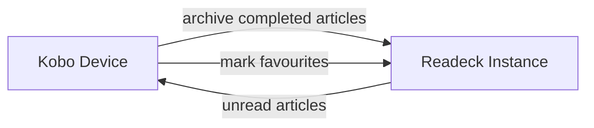

# Kobodeck

[](https://github.com/fkaduk/kobodeck/actions/workflows/ci.yml)
[](https://goreportcard.com/report/github.com/fkaduk/kobodeck)
[](https://github.com/fkaduk/kobodeck/releases/latest)
[](LICENSE)

A minimalist article downloader for Kobo devices.
It can

- fetch content from a **Readeck instance**
- sync some properties (read/archived/favorite) from the **Kobo device** to Readeck



The project is forked from
[wallabako](https://gitlab.com/anarcat/wallabako).

## who is this for ?

This plugin could be useful for you if you

- do not want to use [KOReader](https://koreader.rocks/), which has a native
  Readeck/OPDS plugin or [Plato](https://github.com/baskerville/plato/), which
  includes an article fetcher
- are ok with mixing ebooks and articles in the native Kobo UI - if you want to
  keep them separate, check out [kobeck](https://github.com/Lukas0907/kobeck)
- are fine with a lack of ui - syncing happens in the background

## how to use it

When wifi is turned on, kobodeck connects to your Readeck instance in the
background, downloads new unread articles as KEPUBs with cover images, and
syncs read status back to Readeck.

If any files changed, it triggers a Nickel library rescan via a simulated USB event.
Press **Connect** to rescan immediately, or **Cancel** —
the files are already downloaded either way.


## prerequisites

- a running [hosted](https://readeck.com) or
  [self-hosted](https://readeck.org/en/) Readeck instance
- a Readeck API token (generate one in Readeck under Settings → API tokens)
- a Kobo device running the stock Nickel firmware

## installation or upgrade

To install or upgrade

1. obtain the latest `KoboRoot.tgz`:
   - download it from the releases page, or
   - build from source via `make tarball`
1. save the file in the `.kobo` directory of your e-reader
1. copy and edit the configuration file [`kobodeck.toml`](kobodeck.toml)
1. store it as `.adds/kobodeck/kobodeck.toml` on your Kobo device
1. optionally verify your configuration with
   `kobodeck --config .adds/kobodeck/kobodeck.toml --check`
   via the binary provided in the tarball
1. safely disconnect the reader - it should restart, install kobodeck and remove
   `KoboRoot.tgz`

## uninstalling

Empty the file `.adds/kobodeck/kobodeck.toml`
(delete its contents, but keep the file) and connect to wifi.
Kobodeck will detect the empty config, remove its installed files, and exit.
If uninstall succeeded, `.adds/kobodeck/` will no longer exist.

### manual uninstall

Manual removal requires root access to the device.
The following need to be deleted:

```text
/etc/udev/rules.d/90-kobodeck.rules
/usr/local/bin/kobodeck
/mnt/onboard/.adds/kobodeck/
/mnt/onboard/kobodeck/
```

The last path is the default output directory
(`Output.Path` in the config) - adjust if you changed it.

## development

Check the Makefile for common operations on the project.

### updating the Nickel schema

The integration tests use schema files in `testdata/` named `nickel-schema-{version}.sql`,
where `{version}` is the `DbVersion` from the `KoboReader.sqlite` database.
After a firmware update that changes the database schema, dump the new schema with:

```sh
DB=/media/$USER/KOBOeReader/.kobo/KoboReader.sqlite
VER=$(sqlite3 "$DB" "SELECT version FROM DbVersion;")
sqlite3 "$DB" ".schema" > testdata/nickel-schema-${VER}.sql
```

### future work

- Sync highlights and annotations from the Kobo (`Bookmark` table in
  `KoboReader.sqlite`) to Readeck's annotations API
- Add sync of reading progress (current position) from the Kobo to Readeck -
  note that progress may differ between EPUB and KEPUB formats
- Add functionality to also fetch archived articles
- Add functionality to fetch favourites only
- Syncing is currently only one way, as we avoid writing to Kobo's NickelDB - reverse
  sync may still be worth exploring
- Kobodeck does not inhibit device sleep - if the Kobo sleeps during a
  long sync, downloads may be interrupted
