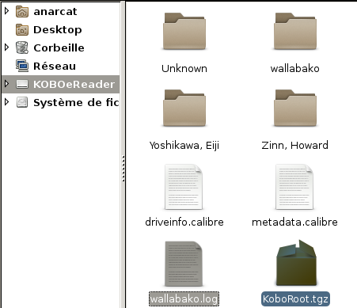
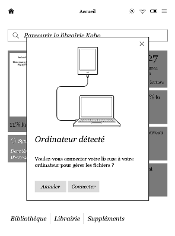

Wallabag downloader
===================


This tool is designed to automatically download Wallabag articles into
your local computer or Kobo ebook reader.

Features:

* **fast**: downloads only files that have changed, in parallel
* **unattended**: runs in the background, when the wifi is turned on, only
  requires you to tap the fake USB connection screen for the Kobo to
  rescan its database
* **status synchronization**: read books are marked as
  read in the Wallabag instance
* **easy install**: just drop the magic file in your kobo reader like any
  other book, edit one configuration file and you're done

The instructions here are mostly for the Kobo E-readers but may work
for other platforms. I have tested this on a Debian GNU/Linux 9
("stretch") system, a Kobo Glo HD and a Kobo Touch.

<!-- markdown-toc start - Don't edit this section. Run M-x markdown-toc-generate-toc again -->
**Table of Contents**

- [Download and install](#download-and-install)
- [Configuration](#configuration)
- [Usage](#usage)
- [Support](#support)
- [Troubleshooting](#troubleshooting)
- [Credits](#credits)
- [Contributing](#contributing)

<!-- markdown-toc end -->



Download and install
====================

Quick start for Kobo devices:

 1. connect your reader to your computer with a USB cable
 2. [download][] the [latest `KoboRoot.tgz`][]
 3. save the file in the `.kobo` directory of your e-reader
 4. create the configuration file as explained in the [configuration](#configuration)
section
 5. disconnect the reader

[latest `KoboRoot.tgz`]: https://gitlab.com/anarcat/wallabako/builds/artifacts/master/file/build/KoboRoot.tgz?job=compile
[download]: https://gitlab.com/anarcat/wallabako/builds/artifacts/master/file/build/KoboRoot.tgz?job=compile

When you disconnect the reader, it will perform what looks like an
upgrade, but it's just the content of the `KoboRoot.tgz` being
automatically deployed. If you connect the reader again, the
`KoboRoot.tgz` file should have disappeared.

When you connect your reader to a Wifi access point, the wallabako
program should run, which should create a `wallabako.log.txt` file at
the top directory of the reader which you can use to diagnose
problems, see also the [troubleshooting](#troubleshooting) section.

Configuration
=============

The next step is to configure Wallabako by creating a `.wallabako.js`
file in the top directory of the reader, with the following content:

    {
      "WallabagURL": "https://app.wallabag.it",
      "ClientId": "14_2vun20ernfy880wgkk88gsoosk4csocs4ccw4sgwk84gc84o4k",
      "ClientSecret": "69k0alx9bdcsc0c44o84wk04wkgw0c0g4wkww8c0wwok0sk4ok",
      "UserName": "joelle",
      "UserPassword": "your super password goes here"
    }

Make sure you use a plain text editor like `Gedit` or `Notepad`, as
LibreOffice will cause you trouble!

Let's take this one step at a time. First, the weird curly braces
syntax is because this is a [JSON](https://en.wikipedia.org/wiki/JSON)
configuration file. Make sure you keep all the curly braces, quotes,
colons and commas (`{`, `}`, `"`, `:`, `,`).

 1. The first item is the `WallabagURL`. This is the address of the
    service you are using. In the above example, we use the official
    [Wallabag.it](https://wallabag.it/) service, but this will change
    depending on your provider. Make sure there is *no* trailing slash
    (`/`).

 2. The second and third items are the "client tokens". Those are
    tokens that you need to create in the Wallabag web interface, in
    the `Developer` section. Simply copy paste those values in place.
 
 3. The fourth and fifth items are your username and passwords. We
    would prefer to not ask you your password, but unfortunately, that
    is [still required by the Wallabag API][password requirement of the API]

 [password requirement of the API]: https://github.com/wallabag/wallabag/issues/2800

Also note that some commandline flags are hardcoded in the
`wallabag-run` script. To modify those, you will
need to modify the file in the `KoboRoot.tgz` file or hack the kobo to
get commandline access. There are also more settings you can set in
the configuration file, see the [troubleshooting](#troubleshooting)
section for more information.



Usage
=====

Kobo devices
------------

If everything was deployed correctly, Wallabako should run the next
time you activate the wireless connection on your device. You will
notice it is running because after a while, the dialog that comes up
when you connect your device with a cable will come up, even though
the device is not connected! Simply tap the `Connect` button to
continue the synchronisation and the library will find the new entries.

When an article downloaded with Wallabako is finished on your reader,
it will be marked as read in Wallabag.

Wallabako also downloads a limited numbers of articles from Wallabag,
and it *will* remove extra articles (for example if they are too old
or were marked as read in Wallabag).

By default, Wallabako will not delete old files from your reader - you
will need to remove those files through the reader interface
yourself. This is to avoid unnecessary synchronisations which are
distracting to the user.

Commandline
-----------

Wallabako can also be compiled installed on a regular computer,
provided that you have the go suite installed. Simply do the usual:

    go get gitlab.com/anarcat/wallabako

If you are unfamiliar with go, you may want to read up on the
[getting started][] instructions. If you do not wish to install golang
at all, you can also [download the standalone binaries][x86_64] for
[64 bits][x86_64] (aka `amd64` or `x86_64`) or [ARM][arm]
(e.g. Raspberry PI).

 [x86_64]: https://gitlab.com/anarcat/wallabako/builds/artifacts/master/file/build/wallabako.x86_64?job=compile
 [arm]: https://gitlab.com/anarcat/wallabako/builds/artifacts/master/file/build/wallabako.arm?job=compile
 [getting started]: https://golang.org/doc/install

You also need to create a [configuration](#configuration) file as
detailed above.

The program looks for the file in the following locations:

1. `$HOME/.config/wallabako.js`
2. `$HOME/.wallabako.js`
3. `/mnt/onboard/.wallabako.js`
4. `/etc/wallabako.js`

You will probably want to choose the first option unless you are
configuring this as a system-level daemon.

Then you can just run wallabako on the commandline. For example, this
will download your articles in the `epubs` directory in your home:

    wallabako -output ~/epubs

Use the `-h` flag for more information about the various flags you can
use on the commandline.

The program is pretty verbose, here's an example run:

    $ wallabako -output /tmp
    2017/01/31 22:16:41 logging in to https://example.net/wallabag
    2017/01/31 22:16:41 CSRF token found: 200 OK
    2017/01/31 22:16:41 logged in successful: 302 Found
    2017/01/31 22:16:42 found 65 unread entries
    2017/01/31 22:16:42 URL https://example.net/wallabag/export/23152.epub older than local file /tmp/23152.epub, skipped
    2017/01/31 22:16:42 URL https://example.net/wallabag/export/23179.epub older than local file /tmp/23179.epub, skipped
    2017/01/31 22:16:42 URL https://example.net/wallabag/export/23170.epub older than local file /tmp/23170.epub, skipped
    2017/01/31 22:16:42 URL https://example.net/wallabag/export/23180.epub older than local file /tmp/23180.epub, skipped
    2017/01/31 22:16:42 URL https://example.net/wallabag/export/23160.epub older than local file /tmp/23160.epub, skipped
    2017/01/31 22:16:42 processed: 5, downloaded: 0
    2017/01/31 22:16:42 completed in 1.44s

You can also run the program straight from source with:

    go run *.go

Support
=======

I will provide only limited free support for this tool. I wrote it,
after all, for my own uses. People are welcome to [file issues][] and
[send patches][], of course, but I cannot cover for every possible use
cases. There is also a [discussion on MobileRead.com][] if you prefer
that format.

 [file issues]: https://gitlab.com/anarcat/wallabako/issues
 [send patches]: https://gitlab.com/anarcat/wallabako/merge_requests
 [discussion on MobileRead.com]: https://www.mobileread.com/forums/showthread.php?p=3467945

Troubleshooting
===============

To troubleshoot issues with the script, you may need to get
commandline access into it, which is beyond the scope of this
documentation. See the following tutorial for example.

 * [Hacking the Kobo Touch for Dummies](http://www.chauveau-central.net/pub/KoboTouch/)
 * [Kobo Touch Hacking](https://wiki.mobileread.com/wiki/Kobo_Touch_Hacking)

Below are issues and solutions I have found during development that
you may stumble upon. Normally, if you install the package correctly,
you shouldn't get those errors so please do file a bug if you can
reproduce this issue.

Logging
-------

Versions from 0.3 to 1.0 were writing debugging information in the
`wallabako.log.txt` on the reader. This is now disabled by default
(see [this discussion for why][]) but can be enabled again by adding a
`logfile` option in the configuration file, like this:

    {
      "WallabagURL": "https://app.wallabag.it",
      "ClientId": "14_2vun20ernfy880wgkk88gsoosk4csocs4ccw4sgwk84gc84o4k",
      "ClientSecret": "69k0alx9bdcsc0c44o84wk04wkgw0c0g4wkww8c0wwok0sk4ok",
      "UserName": "joelle",
      "UserPassword": "your super password goes here",
      "logfile": "/mnt/onboard/wallabako.log.txt"
    }

[this discussion for why]: https://gitlab.com/anarcat/wallabako/merge_requests/1

This will make a `wallabako.log` file show up on your reader that you
can check to see what's going on with the command.

You can increase the verbosity of those logs with the `Debug`
commandline flag or configuration option (set to `true`, without
quotes). WARNING: this *will* include your password and authentication
tokens, so be careful where you send this output.

Configuration file details
--------------------------

Most commandline options (except `-version` and `-config`) can also be
set in the configuration file. Here are the configuration options and
their matching configuration file settings:

| Configuration | Flag           | Default           | Meaning |
| ------------- | -------------- | ----------------- | ------- |
| `Debug`       | `-debug`       | `false`           | include (lots of!) additional debugging information in logs, including passwords  and confidential data |
| `Delete`      | `-delete`      | `false`           | delete EPUB files marked as read or missing from Wallabag |
| `Database`    | `-database`    | `/mnt/onboard/.kobo/KoboReader.sqlite` | path to the Kobo database |
| `Concurrency` | `-concurrency` | 6                 | number of downloads to process in parallel |
| `Count`       | `-count`       | -1                | number of articles to fetch, -1 means use Wallabag default |
| `Exec`        | `-exec`        | nothing           | execute the given command when files have changed |
| `LogFile`     | N/A            | no logging        | rotated logfile to store debug information |
| `OutputDir`   | `-output`      | current directory | output directory to save files into |
| `PidFile`     | `-pidfile`     | `wallabako.pid`   | pidfile to write to avoid multiple runs |
| `RetryMax`    | `-retry`       | 4                 | number of attempts to login the website, with exponential backoff delay |

Some more details about specific settings:

 * If you can't seem to synchronize all your articles and you have a
   large number of unread articles, you may want to change the `Count`
   field in the configuration file. By default, Wallabako only
   downloads a part of the database: it is limited by the number of
   articles returned by the Wallabag listing (`30` at the time of
   writing). If the `Delete` option is set, older articles will be
   *deleted* from the Kobo reader as well. Note that it should be
   fairly safe to use a larger number here, as only `Concurrency`
   (e.g. 6) articles will be downloaded in parallel at a time. It
   could make the first listing request slower, however, if you have a
   huge number of articles. We have reports of operation with 60
   articles without significant performance issues.

 * The `PidFile` is actually written in one of those directories, the
   first one found that works:

    1. `/var/run`
    2. `/run`
    3. `/run/user/UID`
    4. `/home/USER/.`

 * There's no `-logfile` flag anymore since this was not really
   useful: you can just redirect output to a file using shell
   redirection (`> logfile`). Also, it was difficult to implement
   logging for configuration file discovery while at the same time
   allowing the logfile to be changed when commandline flags are
   parsed.

Finally, note that some of those settings are hardcoded in the
`wallabako-run` wrapper script and therefore cannot be overriden in
the configuration file. Those are:

| Flag      | Value                             |
| --------- | --------------------------------- |
| `-output` | `/mnt/onboard/wallabako`          |
| `-exec`   | `/usr/local/bin/fake-connect-usb` |

Changing those settings could be dangerous. In particular, changing
the `-output` directory while enabling `-delete` could delete files
unexpectedly if they match the magic pattern (`N.epub` where N is an
integer).

x509: failed to load system roots and no roots provided
-------------------------------------------------------

You may see this error when running on weird environments;

```
2017/01/30 14:45:46 logging in to https://example.net/wallabag
2017/01/30 14:45:51 <nil> Get https://example.net/wallabag/login: x509: failed to load system roots and no roots provided
2017/01/30 14:45:51 completed in 5.12s
panic: runtime error: invalid memory address or nil pointer dereference
[signal SIGSEGV: segmentation violation code=0x1 addr=0x0 pc=0x11280]

goroutine 1 [running]:
panic(0x2558a0, 0x1061e008)
	/usr/lib/go-1.7/src/runtime/panic.go:500 +0x33c
main.login(0x1060ee20, 0x19, 0x1067d958, 0x7, 0x1060ee60, 0x14, 0x0)
	/home/anarcat/go/src/gitlab.com/anarcat/wallabako/main.go:59 +0x280
main.main()
	/home/anarcat/go/src/gitlab.com/anarcat/wallabako/main.go:147 +0x280
```

This is because your operating system doesn't ship standard X509
certificates in the location the program expects them to be. A
workaround I have found is to copy the
`/etc/ssl/certs/ca-certificates.crt` provided by the `ca-certificates`
package in Debian in the machine.

By default, the tarball creation script adds that magick file to the
`KoboRoot.tgz` archive, which should work around this problem. But
this was never tested from scratch.

> Note: it *may* be possible to fix the program to ignore the
> [SystemRootsError](https://golang.org/pkg/crypto/x509/#SystemRootsError)
> but I would advise against it, if only for obvious security
> reasons...

Command not running
-------------------

If you notice that udev is not running your command, for some reason,
you can restart it with `--debug` which is very helpful. Example:

    [root@(none) ~]# ps ax | grep udev
      621 root       0:00 /sbin/udevd -d
     1242 root       0:00 grep udev
    [root@(none) ~]# kill 621
    [root@(none) ~]# /sbin/udevd --debug
    [1256] parse_file: reading '/lib/udev/rules.d/50-firmware.rules' as rules file
    [1256] parse_file: reading '/lib/udev/rules.d/50-udev-default.rules' as rules file
    [1256] parse_file: reading '/lib/udev/rules.d/60-persistent-input.rules' as rules file
    [1256] parse_file: reading '/lib/udev/rules.d/75-cd-aliases-generator.rules' as rules file
    [1256] parse_file: reading '/etc/udev/rules.d/90-wallabako.rules' as rules file
    [1256] parse_file: reading '/lib/udev/rules.d/95-udev-late.rules' as rules file
    [1256] parse_file: reading '/lib/udev/rules.d/kobo.rules' as rules file
    [...]
    [1276] util_run_program: '/usr/local/bin/wallabako-run' (stdout) '2017/01/31 00:03:50 logging in to https://example.net/wallabag'
    [1256] event_queue_insert: seq 859 queued, 'remove' 'module'
    [1256] event_fork: seq 859 forked, pid [1289], 'remove' 'module', 0 seconds old
    [1276] util_run_program: '/usr/local/bin/wallabako-run' (stdout) '2017/01/31 00:03:50 failed to get login page:Get https://example.net/wallabag/login: dial tcp: lookup example.net on 192.168.0.1:53: dial udp 192.168.0.1:53: connect: network is unreachable'

In the above case, network is down, probably because the command ran
too fast. You can adjust the delay in `wallabako-run`, but really this
should be automated in the script (which should retry a few times
before giving up).

Credits
=======

Wallabako was written by The Anarcat and reviewed by friendly Debian
developers `juliank` and `stapelberg`. `smurf` also helped in
reviewing the code and answering my million newbie questions about go.

Also thanks to [Norbert Preining][] for pulishing the
[Kobo firmare images][] that got me started into this path and allowed
me to easily root my reader. This inspired me to start the related
[kobo-ssh][] project to build smaller, ssh-only images.

[kobo-ssh]: https://gitlab.com/anarcat/kobo-ssh
[Norbert Preining]: https://www.preining.info/
[Kobo firmare images]: https://www.preining.info/blog/2016/01/kobo-firmware-3-19-5761-mega-update-ksm-nickel-patch-ssh-fonts/

This program and documentation is distributed under the AGPLv3
license, see the LICENSE file for more information.

Contributing
============

See the [contribution guide](CONTRIBUTING.md) for more information. In
short: this is a free software project and you are welcome to join us
in improving it, both by fixing things, reporting issues or
documentation.

Design notes
------------

Moved a [separate document](DESIGN.md).

Remaining issues
----------------

There are `XXX` markers in the source code that show other issues that
need to be checked. The other known issues previously stored in this
file have been moved to the [Gitlab issue queue][] to allow for better
visibility and public collaboration.

[Gitlab issue queue]: https://gitlab.com/anarcat/wallabako/issues
